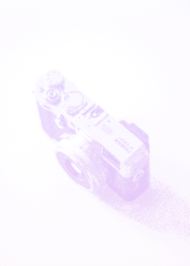

### Generate color gradient ASCII art from photographs
Python3 tool for generating ASCII images locally in batches and a Serverless API for converting images into ASCII art. By default the batch ASCII art is generated with a randomly selected vapor wave color gradient. The API currently only returns black and white ascii images.

This is a modified version of a [tutorial](https://wshanshan.github.io/python/asciiart/) for generating ASCII art with color gradients. It has been extended for batch processing files and deployed to an API.

Input/output:

 

#### Serverless API
The Serverless framework is a tool for easily deploying AWS Lambda functions and associated services like Amazon API Gateway, Cloudwatch, S3 buckets, etc.

Send a `.jpg` or `.png` file to the API and receive a black and white ascii image. Below `input.jpg` is sent to the API and `output_two.png` is received.

`cd examples/ && curl -X POST --data-binary @input.jpg AWS_GATEWAY_API_ENDPOINT_GOES_HERE -o output_two.png`

#### Batch conversion setup
Project uses `pip-tools` and virtual environment (`venv`) for managing dependencies.

Clone the repository and `cd` into the project, then run:
- `python3 -m venv venv && . venv/bin/activate && pip install pip-tools && pip-compile && pip-sync`
- Add photographs (`.png, .jpg`) to be converted to ASCII art into `images` directory.

#### Batch convert images into ASCII images
`cd` into `src` directory and run `python3 python-generate-ascii.py`.

ASCII art is generated in the `results/` directory. A new directory is generated inside results/ based on parameter values and a randomly chosen vapor wave color scheme is applied. These parameters and color gradient can be changed in `python-generate-ascii.py`.
